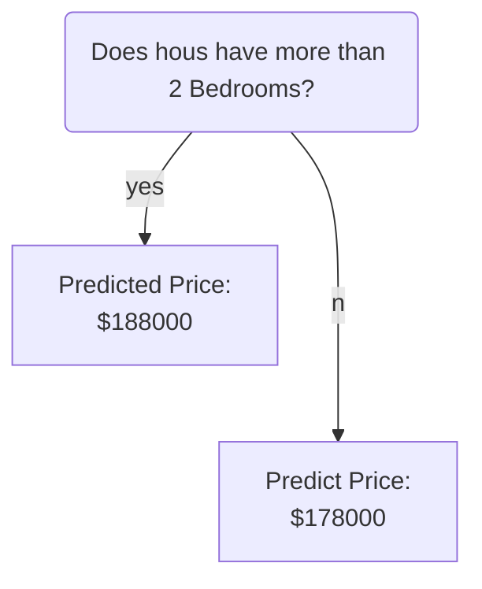

# Kaggle

---

## Titanic

http://kaggle-kr.tistory.com/

<section data-background-color="#ff0000">
	<h2>Color</h2>
</section>

<section>
	
Appears last

	
Appears first

	
Appears second

</section>

<video data-autoplay src="http://clips.vorwaerts-gmbh.de/big_buck_bunny.mp4"></video>

--

### Youtube

- https://www.youtube.com/channel/UC--LgKcZVgffjsxudoXg5pQ
- 9.  https://www.youtube.com/watch?v=qVknmB5OElE&list=PLC_wC_PMBL5MnqmgTLqDgu4tO8mrQakuF&index=9
- [캐글 타이타닉 Titanic - 13. Model development - Machine learningl(Randomforest)](https://www.youtube.com/watch?v=mkytmstQKzI&index=13&list=PLC_wC_PMBL5MnqmgTLqDgu4tO8mrQakuF)
- [캐글 타이타닉 Titanic - 14. Machine learning prediction - feature importance and prediction on test set](https://www.youtube.com/watch?v=4SIKWBjLUKM&list=PLC_wC_PMBL5MnqmgTLqDgu4tO8mrQakuF&index=14)

---

## Sample Decision Tree

